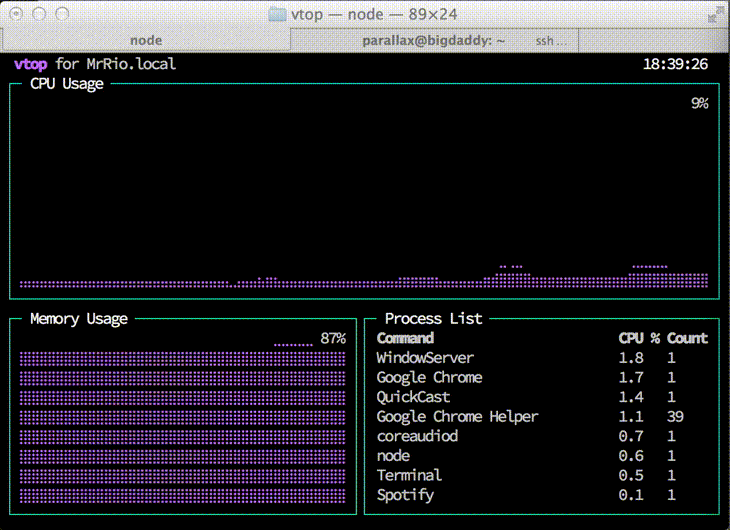

vtop
=========

A graphical activity monitor for the command line. Written in node.js.



How to install
---

If you haven't already got Node.js, then [go get it](http://nodejs.org/).

```
sudo npm install -g vtop
```

Running
---

This is pretty simple too.

```
vtop
```

Keyboard shortcuts
---

* Press 'u' to update to the latest version of vtop.
* Arrow up or k to move up the process list.
* Arrow down or j to move down.
* g to go to the top of the process list.
* G to move to the end of the list.
* dd to kill all the processes in that group

FAQs
----

### How does it work?

It uses [drawille](https://github.com/madbence/node-drawille) to draw CPU and Memory charts with Unicode braille characters, helping you visualize spikes. We also group processes with the same name together.

### I think the CPU % is coming out wrong.

We calculate the CPU percentage as a total of your overall system power. 100% is all cores and HyperThreads maxed out. This is different to how Apple Activity monitor works.

### I think you should change CPU percentage to how Apple's Activity Monitor works.

No I like it this way. Feel free to submit a PR with it as a config option though.

### Can I change the color scheme?

Sure, just do:

```
vtop --theme wizard
```

This loads the theme file in themes/ with the same name. Make your own and send me a Pull Request :)

You could add this to your aliases if you'd like to use it always.

```
alias vtop="vtop --theme brew"
```

### What about measuring server req/s, log entries, etc etc?

Yeah that's on the list :) Feel free to send a pull request though. Check out the sensors/ folder.

### What license is this under?

MIT – do what you like with it :)

